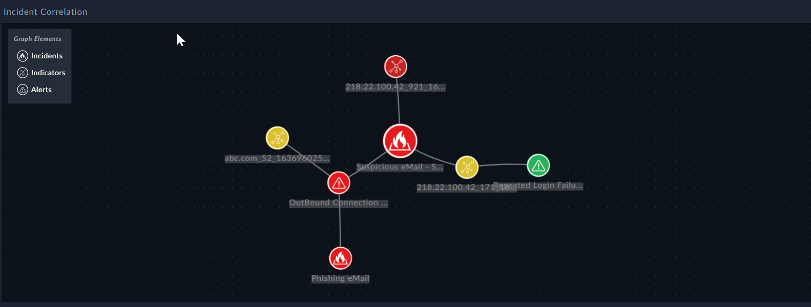

**Incident Correlation Graph**:

 

**Certified**: Yes  

**Publisher**: Fortinet  

**Compatibility**: 7.0.2 or higher

**Applicable**: Dashboards, Reports  

**Widget Details**:  

The following information need to be filled:

| Fields     | Description          |
| -------- | -------------- |
| Incident Correlation Widget Title | Title for the Incident Correlation Widget graph. |
| Incident Node ID | Enter the incident ID which needs to be correlated to other module records. |
| Background | Select from either a dotted or a plain background. |